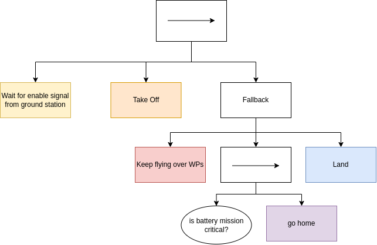
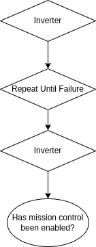
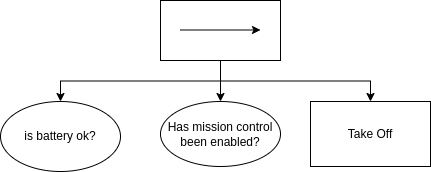
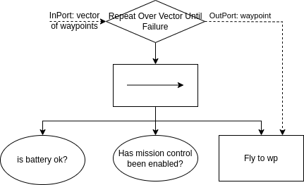
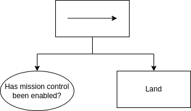
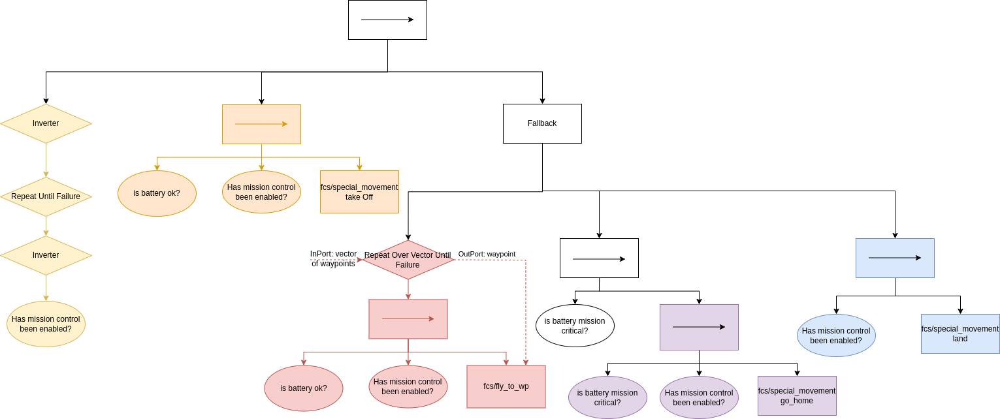

# Mission controller 

The mission controller utilises [behaviour trees](https://en.wikipedia.org/wiki/Behavior_tree_(artificial_intelligence,_robotics_and_control)#:~:text=Article%20Talk,tasks%20in%20a%20modular%20fashion.). 
In particular, it is based on c++ library called [BehaviorTree.Cpp](https://www.behaviortree.dev/). 
Before continuing to read the explanation below, please familiarise yourself with the semantics of behaviour trees.

# Supported scenario
One of the big adventages of behaviour trees is that they are easily configurable by a text file, which means the code can stay same for different scenarios.
There is a folder **config** where you will find xml files, including example of behaviour trees.

## Monitoring scenario

A UAV needs to patrol an area which is specified by a list of waypoints described by their GPS coordinates. If the UAV reaches the last waypoint from the list, it flies to the first one and keeps repeating until an end condition occurs. There are two sources for the end condition to occur: either a command came from a ground station or the UAV’s battery is low.
In the former case, the UAV returns to the position where it started, e.g. to its home location. 
In the latter case, we distinguish between two levels for low battery: it is either mission critical or safety critical. If the UAV’s battery produces mission critical status, then the UAV returns to its home location. Finally, if the battery status is safety critical,  the UAV lands immediately. 

This scenario is supported by the **monitoring_scenario.xml**

### Known limitations (as of 06/10/2023)
- the drone will perform "star" pattern on waypoints; this mean that the drone will fly from its home location to the wp and then return to its home location before flying to another wp. This is due limitations of dji_sdk library which doesn't allow to fly to a single wp but requires a set of minimal three of them, when the first and the last needs to be home locations
- it is assumed in this file, that actions of the drone cannot be interrupted (this is due limitations of FCS interface). You can check **interuptable_monitoring_scenario.xml** for an example of an extended tree which would handle if actions are interruptable. However, this file hasn't been tested so it may contain mistakes.

### Scenario tree explanation

The main behaviour of this case study is a sequence of four steps. After each step SUCCEESed, the next step is triggered to run.

However, due to complexity of each step, there are trees themselves. 

**Wait for enable signal from ground station**

I have implemented a version of a *condition node* in order to check if mission control has been enabled by the ground station. The class is called *IsMissionEnabled* and the condition node returns SUCCESS when it is enabled, otherwise FAILURE.

The tree "Wait for enable signal from ground station" could look like this:

The decorator "Repeat until success" will produce status RUNNING until the condition returns SUCCESS. However, the BehaviourTree.Cpp library doesn't offer *Repeat until success* decorator node. It offers only *Repeat until failure* node. Hence, we need to add two inverters:

**Take off**

Before requesting fcs_interface action to take off, we need to check if the two end conditions hasn't occured.

**Fly**

Similarly, before requesting the drone to fly to a waypoint, we need to check the end conditions too. Additionally, there are several waypoints over which the drone is suppose to patrol. Therefore, I have developed a new *decorator* node called *RepeatOverVectorUntilFailure*. This node takes a vector of waypoints as its input *port* and iterates over them until one of its childs return failure. 

**Land**

For the land, we need to check only the condition if mission controller is enabled. We don't need to check the battery, as the land action will be requested only if the battery is low.

**The complete tree**

### Possible expansion when actions will be interruptible

The step fly changed too. It now consists of a reactive fallback, a condition and an action node. The working of there three nodes is as follows. First, the reactive fallbacks get triggered. Then, it triggers the condition “Has the ground station requested a stop?”. The outcome of a condition node is either SUCCESS or FAILURE. 
In case of a SUCCESS, the reactive fallback will be SUCCESS too and the action node land will be triggered next.
In case of FAILURE, the reactive fallback will trigger the action node Fly. Action nodes can return RUNNING, SUCCESS and FAILURE. 
In case of RUNNING, the reactive fallback node will trigger again the first condition node
In case of SUCCESS, the reactive fallback node returns SUCCESS too and the next action node Land is triggered
In case of FAILURE, the reactive fallback node returns FAILURE which gets propagated to the top node which returns FAILURE too and the whole scenario has failed.

Now we can focus on the action Fly. It can be modelled as a subtree. We can start with a very simple tree:

